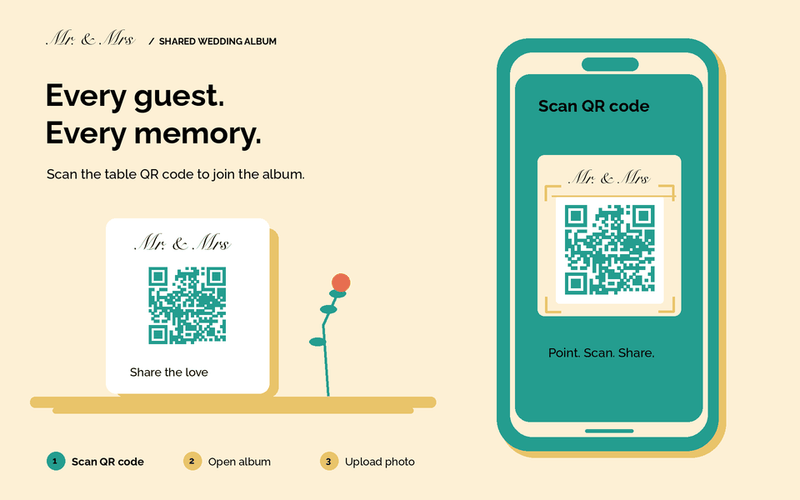
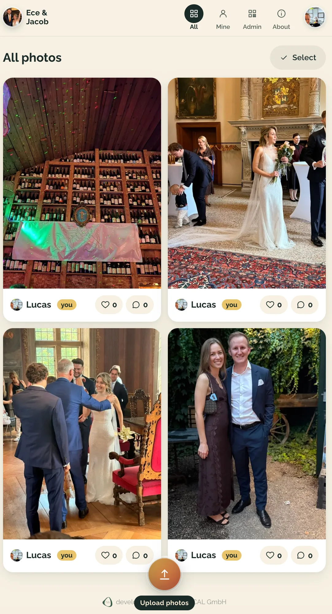

# Wedding QR Album

**A free, self-hosted shared album for your wedding. Guests scan a QR code, upload photos and videos from their phone, and see everyone else's pictures. No app to install, no account to create.**

[](LICENSE)
[](https://github.com/rwQUANTICAL/wedding-qr-album/actions/workflows/deploy.yml)
[](https://svelte.dev)



Print a QR code, put it on the tables, and your guests fill the album during the party. Every photo lands on your own server, so nobody pays a monthly fee and no company keeps your wedding pictures. You can download the whole album as a ZIP file whenever you want.

Works for birthdays, family reunions, company parties and any other event where people take pictures on their phones.

## What guests get

<p align="center">
  
</p>

Your guest opens the camera, scans the QR code on the table and lands in the album. They type their name once, and the app remembers it.

- Upload photos and videos straight from an iPhone or Android phone
- Rotate, crop and caption their own pictures
- Delete their own pictures at any time
- Browse every photo in the album, full screen, like on the Photos app
- Like and comment on pictures
- Download one photo or several at once

iPhone HEIC files work. Videos up to 60 seconds work. No login or account creation (i.e. with email etc.) is required. 

## What you get as the host

Open `/admin` and you run the whole event from one page.

- **Name the album.** The setup wizard asks for the couple's names and the photo in the header. The same card sits in the admin panel, so you can change both later.
- **Print the QR code.** A print page sizes it to 12 cm, and you can download it as PNG or SVG to drop into your own table cards.
- **Manage your guests.** See who uploaded what, promote someone to admin, or remove a guest together with their pictures.
- **Edit and delete anything.** Admins are not limited to their own uploads.
- **Export everything.** One click gives you a ZIP of every photo and video in full resolution.
- **Watch the server.** Small meters show how much disk space, memory and CPU load you are using, so the server never fills up during the party.
- **Recover an account.** If a guest clears their browser data, you send them a recovery link and their old uploads belong to them again.

## Language support

- English
- German
- Turkish

A guest picks the language on the welcome screen, and the app remembers the choice.

## Device support

- iOS (iPhone, iPad)
- Android
- Mac and PC in any modern browser

The app scales with any device. Uploads work from all devices.

## Why not a paid app or Immich?

| | Wedding QR Album | Paid wedding photo apps | Immich |
|---|---|---|---|
| Price | Free, you pay for a server | 20 to 100 EUR per event | Free |
| Where the photos live | Your server | The vendor's cloud | Your server |
| Guest needs an account | No | Sometimes | Yes |
| Guest needs an app | No | Sometimes | Yes, for uploads |
| QR code for the tables | Built in | Built in | No |
| Videos | Up to 60 seconds | Depends on the plan | Yes |
| Upload window | As long as you keep the server | 3 to 12 months | Unlimited |

Immich is a great replacement for Google Photos, and it is the wrong tool here. It expects every person to have an account, so a room full of guests cannot drop pictures into a shared album. That gap is what this project fills.

## Quick start with Docker

You need a Linux server with Docker installed, ports 80 and 443 open, and a domain whose DNS record already points at the server. Caddy needs the DNS in place to fetch the certificate.

```bash
git clone https://github.com/rwQUANTICAL/wedding-qr-album.git
cd wedding-qr-album
./scripts/setup.sh
```

The script asks for your domain, generates the two secrets, writes `.env`, creates the data folders, pulls the image from `ghcr.io/rwquantical/wedding-qr-album` and starts the containers. Caddy fetches a TLS certificate from Let's Encrypt, so the site is on HTTPS within a minute. The image is built for amd64 and arm64, so a Raspberry Pi works too.

At the end it prints your setup link. Open it once:

```
https://your-domain.com/setup?key=<your ADMIN_KEY>
```

Type the names of the couple, pick a photo for the header, and you are live. Both settings live in the database, so you can change them any time in the admin panel. The same link with `/admin` instead of `/setup` opens the control room, where you print the QR code for the tables.

### Update

```bash
git pull
docker compose -f deploy/docker-compose.image.yml pull
docker compose -f deploy/docker-compose.image.yml up -d
```

Photos, database and settings live in `/data` on the host, outside the containers, so an update never touches them.

Prefer to build from source? Use `deploy/docker-compose.yml` with `up -d --build` instead. That is what our own deploy pipeline does.

### Run it on your laptop first

You need Node 22, plus `ffmpeg` and `libheif` for videos and iPhone photos (`brew install ffmpeg libheif` on a Mac, `apt install ffmpeg libheif-examples` on Debian or Ubuntu).

```bash
./scripts/setup.sh --local
npm install
npm run dev
```

The app runs on `http://localhost:5173` and writes its database and pictures to `./data`.

## Configuration

Everything lives in `.env`.

| Variable | What it does |
|---|---|
| `PUBLIC_BASE_URL` | The address the QR code points to |
| `ADMIN_KEY` | Secret in the admin link, `/admin?key=...` |
| `COOKIE_SECRET` | Signs the cookie that identifies a guest |
| `DATA_DIR` | Where the SQLite database and the media files go |
| `DOMAIN` | Domain for Caddy and its TLS certificate |
| `ORIGIN` | Public origin for SvelteKit, for example `https://photos.example.com` |
| `EVENT_TITLE` | Fallback for the header, only used before you run the setup wizard |

## Make it yours

- **Names and photo in the header:** the setup wizard at `/setup`, or the Event card in the admin panel. No rebuild, no file to replace.
- **Colours:** the palette sits in the CSS variables at the top of `src/app.css`.
- **Font:** Raleway ships with the app, swap the `@fontsource-variable` import in `src/app.css`.
- **Wording and languages:** all text lives in `src/lib/i18n/messages.ts`, three dictionaries side by side. Copy one to add a fourth language.
- **Upload limits:** photo size, video size and video length sit in `src/lib/limits.ts`.

## How it works

A guest uploads a file, and the server hands it to a small job queue instead of making the phone wait. The queue writes four versions of every photo with sharp:

| Version | Size | Quality | Used for |
|---|---|---|---|
| Original | 3000 px | 88 | Downloads |
| Web | 1600 px | 82 | Full screen view |
| Card | 900 px | 80 | The photo wall |
| Thumb | 480 px | 75 | Small previews and selection |

Compression stays light on purpose, so a picture still looks good when someone prints it later. Budget about 2 to 3 GB of disk for every 1000 photos.

Videos go through ffmpeg to H.264 at 1080p, and the app grabs a poster frame one second in. iPhone HEIC files run through `heif-convert` before sharp touches them.

The stack stays small: SvelteKit with the Node adapter, SQLite through better-sqlite3, sharp for images, ffmpeg for video, Caddy in front. No Postgres, no Redis, no S3 bucket, no third-party service. Two containers and a folder on disk.

## Back up your album

`deploy/backup.sh` copies the SQLite database and the media folder to a target of your choice. It needs `sqlite3` and `rsync` on the host. Set `BACKUP_TARGET`, add it to cron, and test the restore before the wedding rather than after.

## Contributing

Issues and pull requests are welcome. Run `npm run check` before you open one, the project keeps svelte-check at zero errors.

## License

MIT. Copy it, change it, host it for your own wedding. No attribution required, no strings attached.

**Want us to host it for you?** Write to [info@quantical.com](mailto:info@quantical.com). We run your album on GDPR-compliant servers in Germany, set up your names, your photo and your printed QR codes, and hand you a finished link. That service costs extra. The code here stays free.

Built by [rwQUANTICAL GmbH](https://quantical.com/en/) in Düsseldorf for weddings, and released for anyone who wants the same thing.
